# Enterprise Threat Hunting Lab using Wazuh SIEM
A hands-on enterprise threat hunting lab built using **Wazuh SIEM**, **Windows 11 Enterprise**, and **Sysmon** to simulate real-world endpoint monitoring and security operations.  

## 📌 Project Overview

This project demonstrates how to build a Security Operations Center (SOC) lab using **Wazuh SIEM**, **Windows 11 Enterprise**, and **Sysmon**. The lab collects Windows endpoint telemetry, monitors security events, detects suspicious activities, maps alerts to the MITRE ATT&CK framework, and provides centralized visibility through Wazuh dashboards.

### Objectives

- Monitor Windows endpoint activity
- Collect Windows Event Logs and Sysmon telemetry
- Detect suspicious processes and security events
- Perform threat hunting using Wazuh
- Analyze alerts using dashboards
- Perform vulnerability assessment
- Review security configuration compliance
- Map detections to the MITRE ATT&CK framework

## 🏗️ Lab Architecture

```
                     +----------------------+
                     | Windows 11 Endpoint  |
                     |      + Sysmon        |
                     +----------+-----------+
                                |
                           Wazuh Agent
                                |
                                v
                     +----------------------+
                     |    Wazuh Server      |
                     | Manager + Indexer    |
                     | OpenSearch Dashboard |
                     +----------+-----------+
                                |
                                v
                 Threat Hunting & Security Monitoring
```
## 🛠️ Technologies Used

| Technology | Purpose |
|------------|---------|
| Wazuh 4.12 | SIEM and Threat Detection |
| Windows 11 Enterprise | Monitored Endpoint |
| Sysmon | Advanced Windows Event Logging |
| OpenSearch Dashboards | Alert Visualization |
| Windows Event Logs | Security Event Collection |
| MITRE ATT&CK | Threat Classification |

# 🖥️ Windows Endpoint

The Windows 11 Enterprise virtual machine acts as the monitored endpoint in this lab. It generates Windows Event Logs and Sysmon telemetry, which are collected by the Wazuh Agent and forwarded to the Wazuh Server for analysis.

## Windows Desktop


---

## System Information

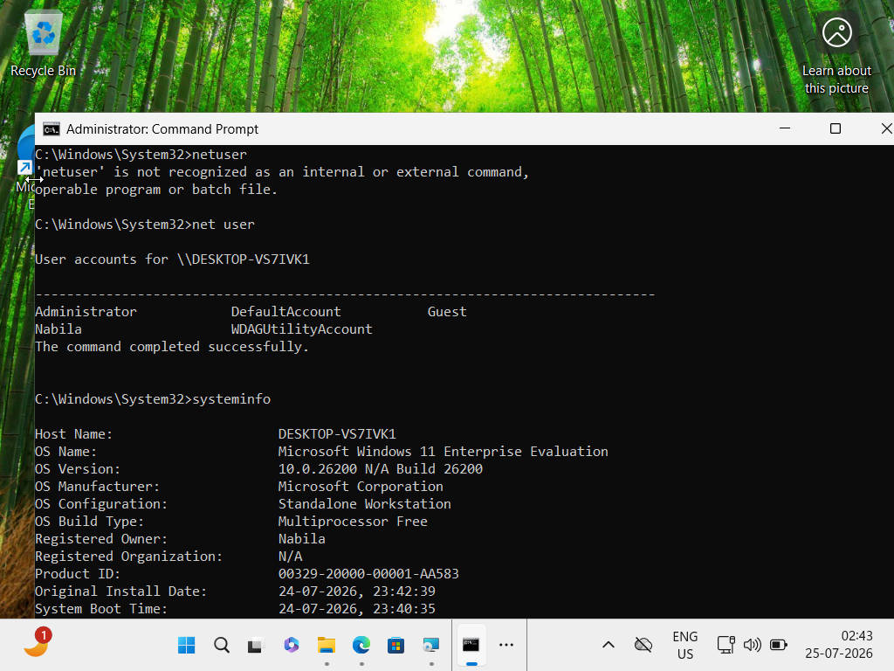

---

## Network Configuration

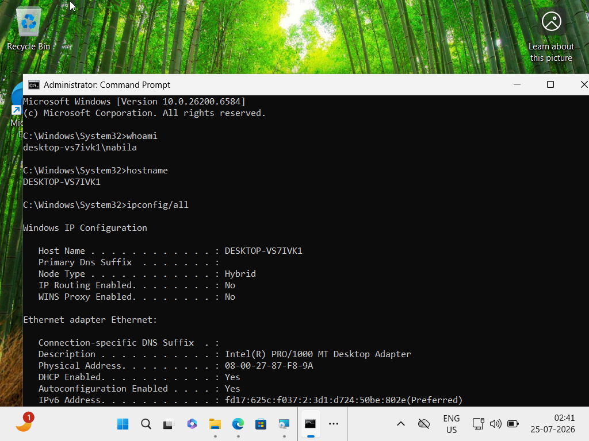

---

## Running Processes

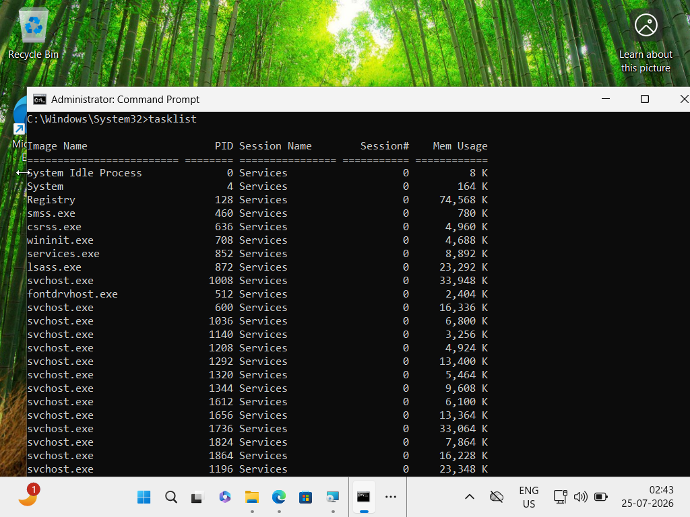

# 🛡️ Wazuh Agent Registration

The Windows 11 Enterprise endpoint was successfully enrolled with the Wazuh Server using the Wazuh Agent. Once connected, the endpoint continuously forwarded Windows Event Logs and Sysmon telemetry for centralized monitoring and analysis.

This enabled real-time visibility into endpoint activity, allowing the Wazuh platform to collect logs, generate alerts, and support threat hunting investigations.

## Endpoint Overview

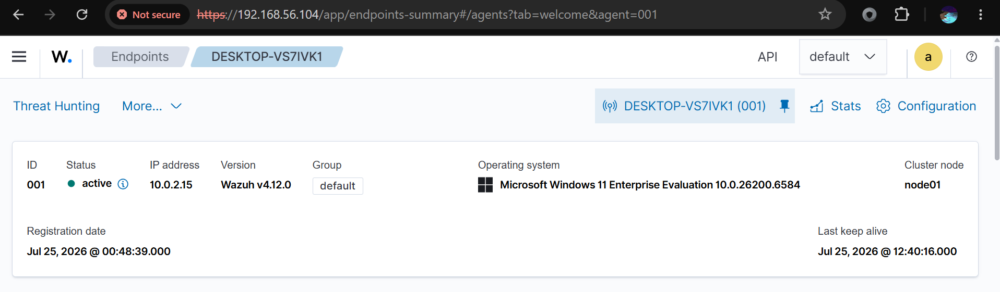

---

## Endpoint Inventory

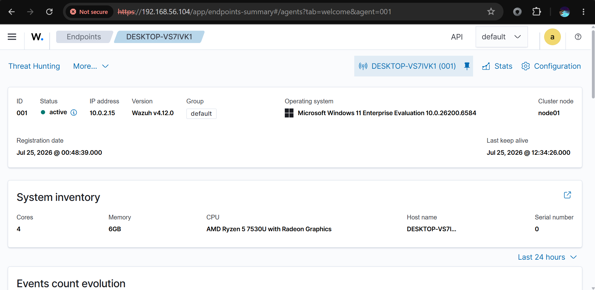

---

# 🔍 Threat Hunting

The Threat Hunting dashboard provides centralized visibility into security events collected from the Windows endpoint. Events generated by Sysmon and Windows Event Logs can be searched, filtered, and investigated to identify suspicious activities.

The dashboard helps analysts correlate events, investigate alerts, and understand attacker behavior using detailed event telemetry.

## Events Overview

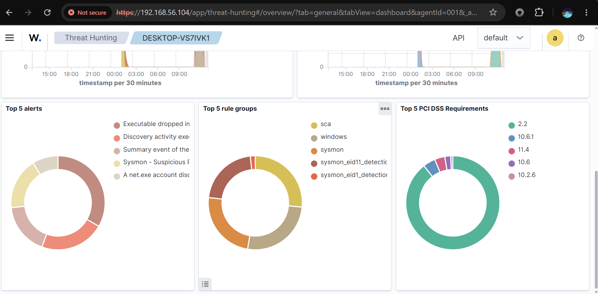

---

## Dashboard Overview

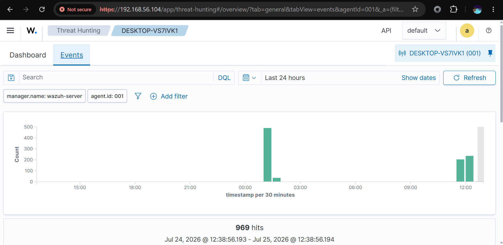


---

# 🚨 Alert Analysis

Wazuh automatically analyzes incoming endpoint telemetry and generates alerts based on predefined detection rules. These alerts help identify suspicious processes, system activities, and potential security incidents.

The alerts are grouped by severity, rule groups, and event categories, enabling efficient investigation and prioritization.

## Alerts Dashboard

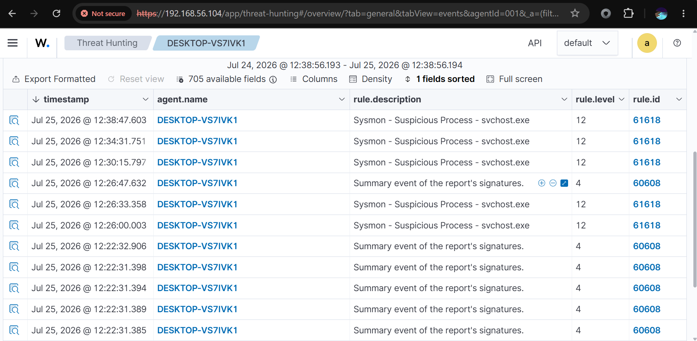

---

## Top Alerts and Rule Groups

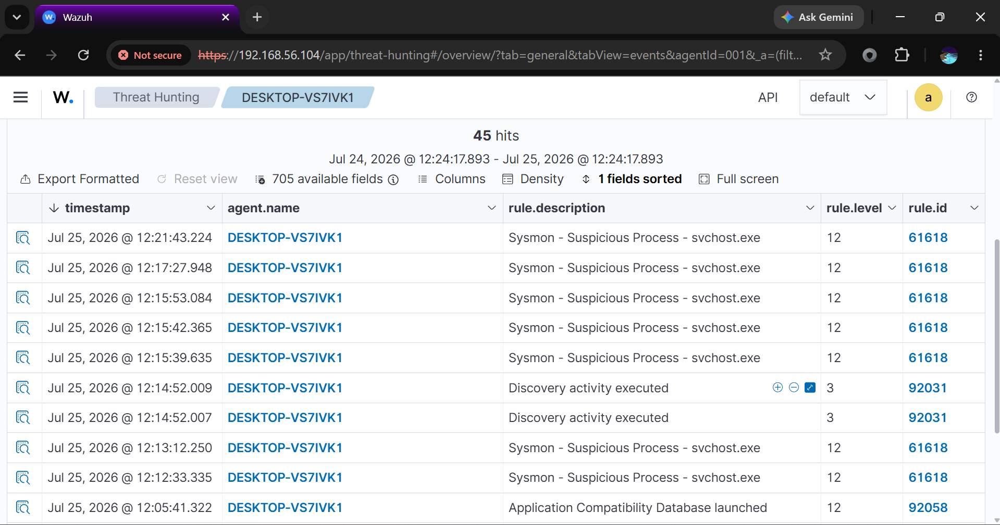

---

## Alert Groups and Timeline

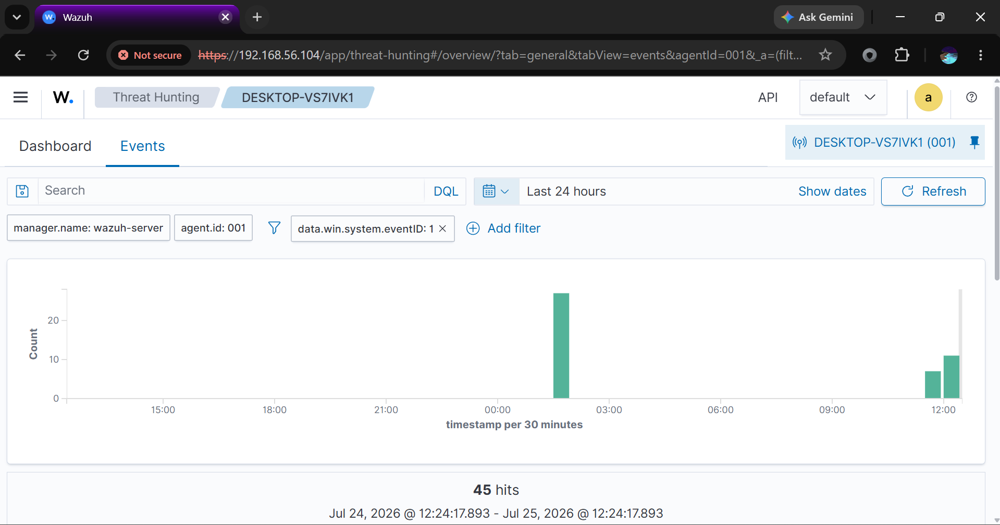

---

# 🔎 Event Investigation

Each alert can be investigated in detail through the Wazuh Threat Hunting interface. Analysts can inspect process information, event timestamps, rule descriptions, MITRE ATT&CK mappings, and additional telemetry to understand the root cause of an alert.

## Suspicious Process Events

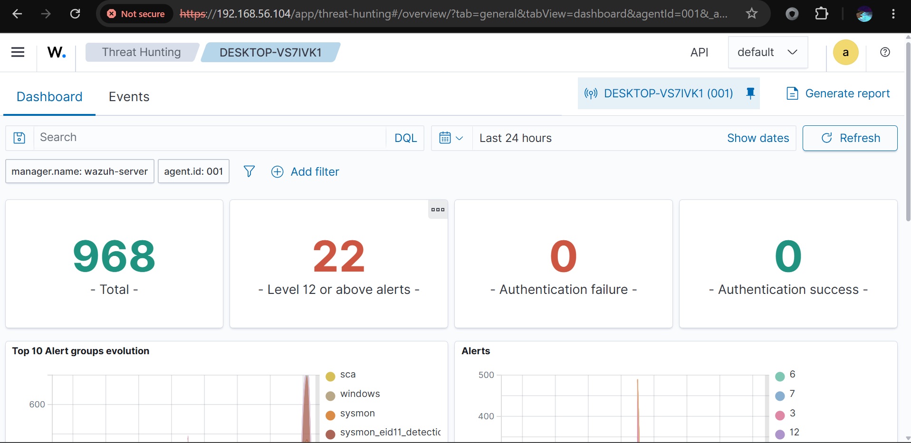

---

## Event Details

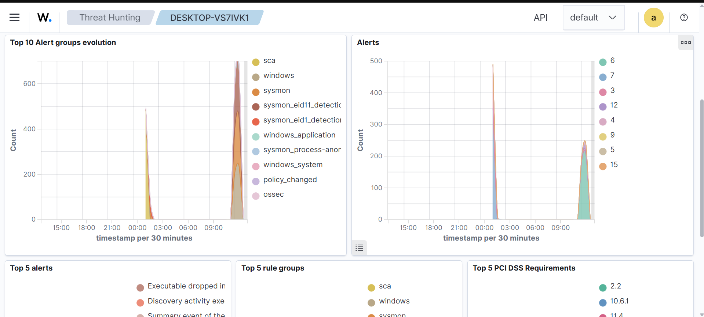

---

# 🎯 MITRE ATT&CK Mapping

Wazuh maps detected activities to the MITRE ATT&CK framework, helping security analysts understand attacker techniques and tactics. This provides valuable context during investigations and improves incident response.

The framework categorizes observed behaviors into standardized attack techniques, making it easier to identify potential threats.

## MITRE ATT&CK Overview


---

# 🛡️ Vulnerability Assessment

Wazuh continuously scans the monitored endpoint for known software vulnerabilities and displays their severity. This helps security teams identify outdated software and prioritize remediation efforts.

## Vulnerability Summary

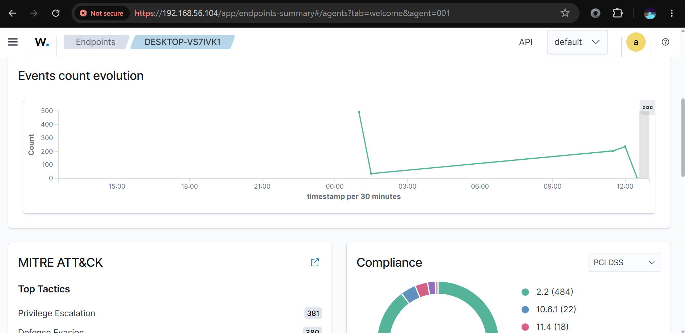

---

## Vulnerability Severity

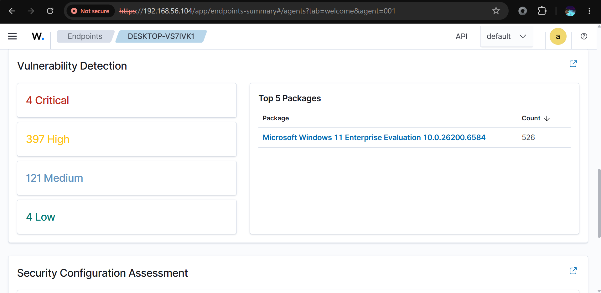

---

# ⚙️ Security Configuration Assessment

Wazuh evaluates the Windows endpoint against security best practices and compliance benchmarks. The Security Configuration Assessment (SCA) module identifies configuration weaknesses and highlights areas that require attention.

## Security Configuration

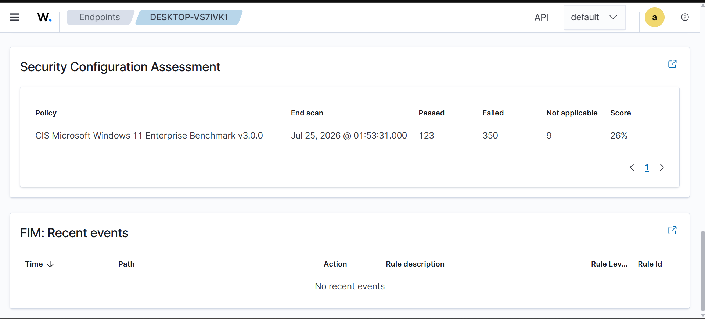

---

# 🖥️ Wazuh Server

The Wazuh Server acts as the central component of the lab, responsible for receiving endpoint telemetry, processing security events, storing indexed data, and serving dashboards through OpenSearch.

The server consists of:

- Wazuh Manager
- Wazuh Indexer
- OpenSearch Dashboards

## Wazuh Server Status

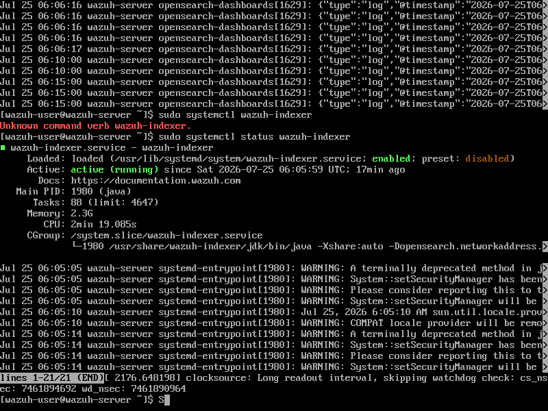

# 📚 Key Learnings

Through this project, I gained practical experience in:

- Deploying and configuring Wazuh SIEM
- Integrating Windows endpoints using the Wazuh Agent
- Collecting and analyzing Sysmon telemetry
- Investigating Windows security events
- Performing threat hunting using Wazuh dashboards
- Understanding MITRE ATT&CK mappings
- Reviewing endpoint vulnerabilities
- Assessing Windows security configurations

  ---

# 🚀 Future Improvements

Potential enhancements for this lab include:

- Integrating additional Windows and Linux endpoints
- Simulating common attack techniques using Atomic Red Team
- Creating custom Wazuh detection rules
- Configuring email or Slack alert notifications
- Building custom dashboards for threat hunting
- Integrating threat intelligence feeds

  # 👤 Author

**Nabila S**

Aspiring SOC Analyst | Cybersecurity Enthusiast
LinkedIn: https://www.linkedin.com/in/nabila-s-587b74305
